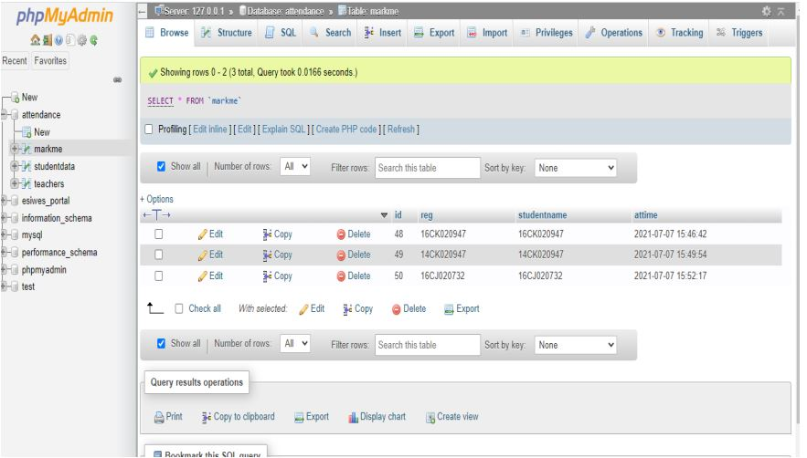

Face Recognition Attendance System
8==================
My Final Year Project: A Face Recognition Attendance System Developed specially for the e-SIWES Portal of Covenant University.
Turns out that this is the second to the last phase of this project.

Front End Application
-----

Libraries Installed for Python 3
-----
* cmake
* dlib
* face-recognition
* numpy
* opencv-python

phpMyAdmin Local Server
-----

